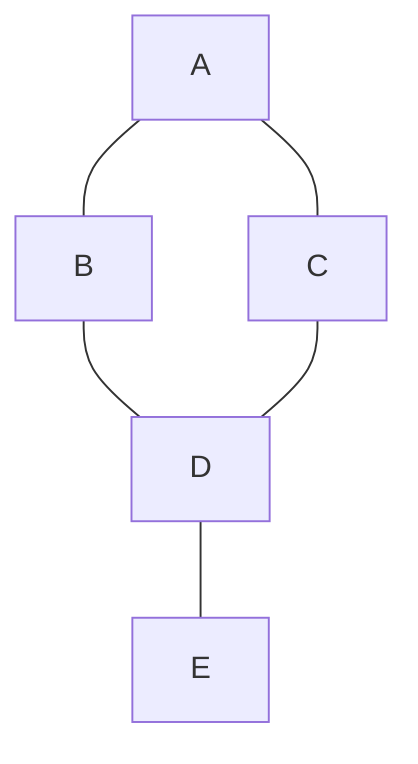

graph TD
## Graphs

### 1. Overview
A graph G = (V, E) consists of a set of vertices V and a set of edges E that connect pairs of vertices. Graphs can be:
- Directed vs undirected
- Weighted vs unweighted
- Simple (no parallel edges/self-loops) vs multigraph

Graphs model networks, relationships, dependencies, and traversal problems.

### 2. Representations
- Adjacency list: store for each vertex a list of neighbors. Space $O(|V| + |E|)$ — best for sparse graphs.
- Adjacency matrix: 2D array of size $|V| \times |V|$. Space $O(|V|^2)$ — constant-time edge checks, good for dense graphs.
- Edge list: list of edges (u, v, w) — convenient for algorithms like Kruskal.

### 3. Traversals & basic algorithms
- DFS (Depth-First Search): explores deep before backtracking. Use recursion or an explicit stack. Useful for cycle detection and topological sort.
- BFS (Breadth-First Search): explores in layers; uses a queue. Finds shortest path in unweighted graphs.

Pseudocode (BFS shortest path):
```
BFS(start):
    dist[start] = 0
    enqueue(start)
    while queue not empty:
        u = dequeue()
        for v in neighbors(u):
            if dist[v] not set:
                dist[v] = dist[u] + 1
                enqueue(v)
```

### 4. Important algorithms
- Shortest paths: Dijkstra (non-negative weights), Bellman-Ford (negative weights, O(VE)), Floyd-Warshall (all-pairs, O(V^3)).
- Minimum spanning tree: Kruskal (edge-sorting + union-find), Prim (priority queue over vertices).
- Topological sort: DFS finishing times or Kahn's algorithm (indegree queue) for DAGs.
- Strongly connected components: Kosaraju (two-pass DFS), Tarjan (single-pass using lowlink values).

### 5. Complexity summary
- BFS/DFS: $O(|V| + |E|)$
- Dijkstra (binary heap): $O((|V| + |E|) \log |V|)$
- Kruskal (sorting edges): $O(|E| \log |E|)$ plus union-find costs

### 6. Common interview problems & patterns
- Detect cycle in directed and undirected graphs
- Shortest path in grid (0-1 BFS for edge weights 0/1)
- Bipartite checking (coloring via BFS/DFS)
- Using BFS layer ordering for shortest path reconstruction

### 7. Diagrams
Simple undirected graph:


### 8. Notes and heuristics
- Use adjacency list for sparse graphs and adjacency matrix for dense graphs or constant-time checks.
- Preprocess graphs (compress coordinates, remove self-loops) when needed for algorithmic efficiency.
