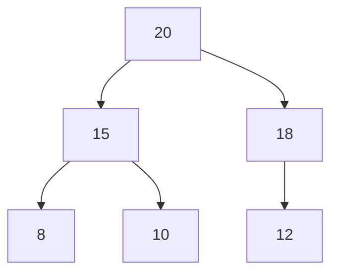

graph TD
## Heaps

### 1. Overview
A heap is a specialized complete binary tree satisfying the heap-order property: in a max-heap, every parent node's key is &ge; its children; in a min-heap, every parent is &le; its children. Because heaps are complete binary trees, they are efficiently stored in arrays.

### 2. Array representation and index arithmetic
- parent(i) = floor((i-1)/2)
- left(i) = 2*i + 1
- right(i) = 2*i + 2

This mapping makes traversal and swaps cache-friendly and avoids explicit pointer overhead.

### 3. Core operations
- insert(item): append to end, then `sift-up` (swap with parent while heap-order violated) — $O(\log n)$.
- extract-max / extract-min: remove root, move last element to root, `sift-down` (swap with larger/smaller child) — $O(\log n)$.
- peek(): $O(1)$.
- heapify (build-heap): transform arbitrary array into heap in $O(n)$ time using bottom-up `sift-down`.

Java example (min-heap wrapper using array / binary heap):
```java
public class MinHeap {
    private ArrayList<Integer> a = new ArrayList<>();

    private void siftUp(int i){
        while (i > 0) {
            int p = (i - 1) / 2;
            if (a.get(i) >= a.get(p)) break;
            Collections.swap(a, i, p);
            i = p;
        }
    }

    public void add(int x) { a.add(x); siftUp(a.size()-1); }

    public int poll(){
        if (a.isEmpty()) throw new RuntimeException("Empty");
        int root = a.get(0);
        int last = a.remove(a.size()-1);
        if (!a.isEmpty()) { a.set(0, last); siftDown(0); }
        return root;
    }

    private void siftDown(int i){
        int n = a.size();
        while (true){
            int l = 2*i+1, r = 2*i+2, smallest = i;
            if (l < n && a.get(l) < a.get(smallest)) smallest = l;
            if (r < n && a.get(r) < a.get(smallest)) smallest = r;
            if (smallest == i) break;
            Collections.swap(a, i, smallest);
            i = smallest;
        }
    }
}
```

### 4. Complexity
- insert / extract: $O(\log n)$
- peek: $O(1)$
- heapify: $O(n)$ (proof sketch: most nodes are leaves or near leaves so total work sums to linear)
- space: $O(n)$

### 5. Variants and use-cases
- Binary heap (binary tree in array): common priority queue implementation.
- d-ary heaps (e.g., 4-ary): reduce depth, useful when decrease-key is infrequent.
- Pairing heap, Fibonacci heap: better amortized times for decrease-key (used in advanced shortest-path implementations).

Use cases: priority queues, Dijkstra's algorithm, event simulation, heap-sort (in-place variant using array, $O(n\log n)$).

### 6. Diagrams
Array example: `[20, 15, 18, 8, 10, 12]`


### 7. Notes & pitfalls
- Heaps are not suited for fast arbitrary deletion or membership tests (those cost $O(n)$). Use balanced BSTs or hash tables for those use-cases.
- For k-smallest/k-largest problems and streaming top-k, use fixed-size heaps to maintain current top-k efficiently.
