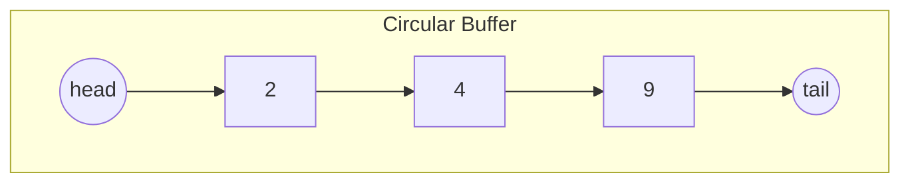

## Queues

### 1. Overview
A queue is a linear ADT that models First-In-First-Out (FIFO) behavior. The earliest enqueued element is the first dequeued. Queues are used in scheduling, buffering, breadth-first traversal, and many streaming scenarios.

### 2. Core operations
- enqueue(x): add element to the rear (tail).
- dequeue(): remove and return element from the front (head); error if empty.
- peek() / front(): return front element without removing.
- isEmpty(), size().

All primary operations are $O(1)$ in typical implementations.

### 3. Implementations
- Circular array (ring buffer): use `head` and `tail` indices with modulo arithmetic. Avoids shifting when elements are removed.
- Singly-linked list with `head` and `tail` pointers: enqueue at tail, dequeue at head — both $O(1)$.
- Two-stack queue: implement queue using two stacks (`in` and `out`). Enqueue: push to `in`. Dequeue: if `out` empty, pop all from `in` to `out`, then pop `out`. Amortized $O(1)$ dequeue.

Java example (circular buffer simplified):
```java
public class RingQueue<E> {
    private E[] data;
    private int head = 0, tail = 0, size = 0;

    @SuppressWarnings("unchecked")
    public RingQueue(int capacity) { data = (E[]) new Object[capacity]; }

    public void enqueue(E x){
        if (size == data.length) throw new RuntimeException("Full");
        data[tail] = x;
        tail = (tail + 1) % data.length;
        size++;
    }

    public E dequeue(){
        if (size == 0) throw new RuntimeException("Empty");
        E val = data[head]; data[head] = null;
        head = (head + 1) % data.length; size--;
        return val;
    }
}
```

### 4. Complexity
- Time: `enqueue`, `dequeue`, `peek` — $O(1)$ (amortized for dynamic resizing).
- Space: $O(n)$ for n elements.

### 5. Variants and specialized queues
- Deque (double-ended queue): insert/remove from both ends; used in sliding-window problems.
- Priority queue: remove element based on priority; typical implementation uses a heap.
- Blocking queues / concurrent queues: used in producer-consumer multithreaded systems.

### 6. Common algorithms & interview problems
- BFS (shortest path in unweighted graph), sliding window maximum (use deque), moving average (circular buffer), rate limiting.

### 7. Diagrams
Circular queue representation:


### 8. Notes & pitfalls
- For array-based queues, decide policy on full buffer: resize, drop, or block.
- For two-stack queue, worst-case single dequeue may be $O(n)$, but amortized cost is $O(1)$.
