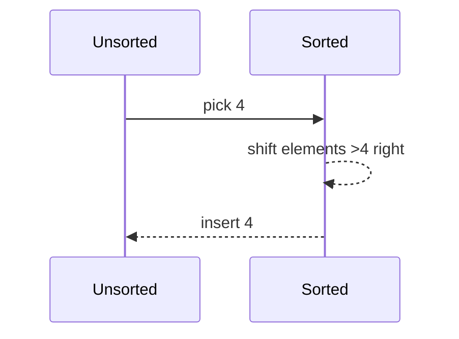
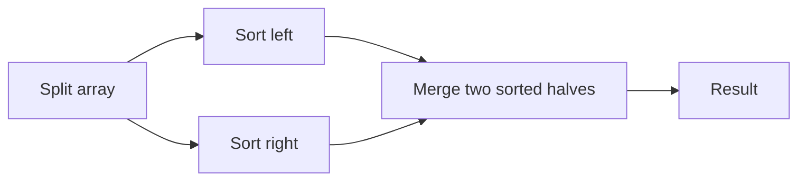
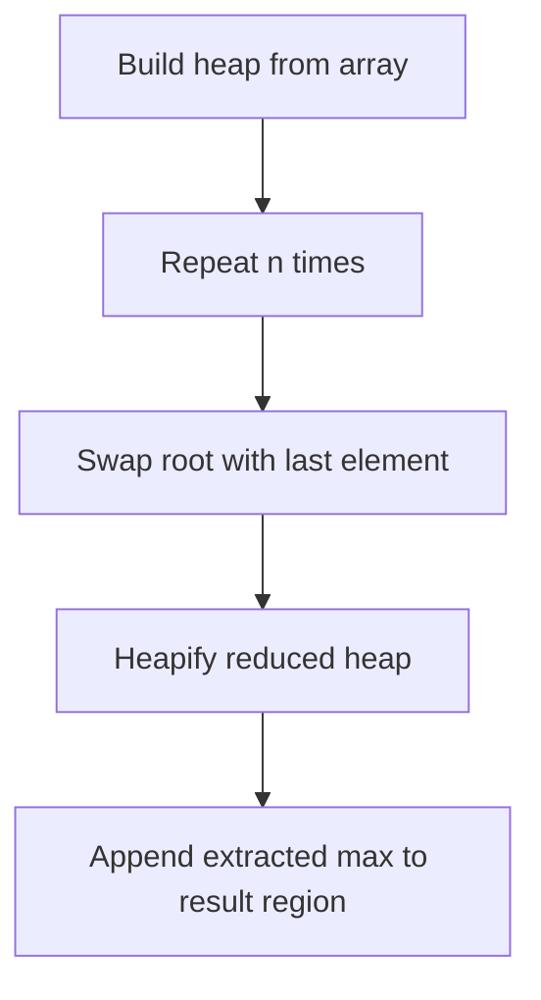

# Sorting — Detailed Notes with Diagrams

## Overview

Sorting arranges the elements of a collection in a defined order (usually ascending or descending). Good sorting is critical because it enables efficient searching, grouping, and other algorithms.

Key properties:
- **Stable**: equal elements keep their original relative order.
- **In-place**: uses only O(1) or O(log n) extra space.
- **Comparison vs Non-comparison**: comparison sorts compare elements (e.g., Quick, Merge). Non-comparison sorts use value properties (e.g., Counting, Radix).

## Complexity Notation (reminder)
- Time complexities are expressed using $n$ for number of elements and $\log n$ for logarithm base 2 unless stated otherwise.
- Space is extra auxiliary memory beyond the input.

## Summary Table (quick reference)

| Algorithm | Time (Best) | Time (Avg) | Time (Worst) | Space | Stable |
|---|---:|---:|---:|---:|:---:|
| Bubble | $O(n)$ | $O(n^2)$ | $O(n^2)$ | $O(1)$ | Yes |
| Insertion | $O(n)$ | $O(n^2)$ | $O(n^2)$ | $O(1)$ | Yes |
| Selection | $O(n^2)$ | $O(n^2)$ | $O(n^2)$ | $O(1)$ | No |
| Merge | $O(n\log n)$ | $O(n\log n)$ | $O(n\log n)$ | $O(n)$ | Yes |
| Quick | $O(n\log n)$ | $O(n\log n)$ | $O(n^2)$ | $O(\log n)$ avg | No (but can be) |
| Heap | $O(n\log n)$ | $O(n\log n)$ | $O(n\log n)$ | $O(1)$ | No |
| Counting | $O(n + k)$ | $O(n + k)$ | $O(n + k)$ | $O(k)$ | Yes |
| Radix | $O(d(n + k))$ | $O(d(n + k))$ | $O(d(n + k))$ | $O(n + k)$ | Yes |

## Elementary Comparison Sorts

### Bubble Sort
Idea: repeatedly compare adjacent items and swap when out-of-order. After each pass the largest unsorted element "bubbles" to the end.

Mermaid flow for one pass:

```mermaid
flowchart TD
  A[Start: i=0] --> B{Compare A[i] and A[i+1]} 
  B -- greater --> C[Swap]
  B -- not greater --> D[No swap]
  C --> E[i++]
  D --> E
  E --> F{end of pass?}
  F -- no --> B
  F -- yes --> G[Next pass or done]
```

When the array is almost sorted, Bubble is $O(n)$ (optimized with a swapped-flag). Use for teaching and tiny arrays only.

Example (step-by-step):

Initial: [5, 1, 4, 2, 8]

Pass 1: [1, 4, 2, 5, 8]

Pass 2: [1, 2, 4, 5, 8]

Done.

### Insertion Sort
Idea: build a sorted prefix by inserting each next element into the correct position.

Mermaid sequence showing insertion of value 4 into `[1,3,5,6]`:



Insertion is efficient on small or nearly-sorted arrays (adaptive). It's often used as the base case inside divide-and-conquer sorts (e.g., merge sort for small subarrays).

### Selection Sort
Idea: repeatedly select the minimum from the unsorted region and swap it to the front.

Selection does at most $n$ swaps but still performs $O(n^2)$ comparisons. Useful when write operations are expensive.

## Divide and Conquer: Merge & Quick

### Merge Sort
Idea: divide the array into halves, sort each half, then merge.

Divide phase complexity: $T(n)=2T(n/2)+O(n)$ leads to $T(n)=O(n\log n)$ by Master Theorem.

Merge diagram:



Merge is stable and predictable. Space cost is $O(n)$ for the merge buffers (can be implemented in-place with complexity and engineering cost).

### Quick Sort
Idea: pick a pivot, partition the array into <pivot and >pivot, then recurse.

Partition illustration (Lomuto partition):

```mermaid
flowchart LR
  A[Array] --> B[Choose pivot arr[hi]]
  B --> C[Partition: i=start-1]
  C --> D[for j=start..hi-1: if arr[j]<=pivot swap arr[++i],arr[j]]
  D --> E[swap arr[i+1],arr[hi]]
  E --> F[Pivot placed at i+1]
```

Quick's average time is $O(n\log n)$ but worst-case $O(n^2)$ for bad pivots (sorted input with naive pivot choice). Practical implementations use randomized pivots or median-of-three.

## Heap Sort
Idea: use a binary heap data structure to repeatedly extract the max (or min) and rebuild the heap.

Operations:
- build-heap: $O(n)$ (sift-down approach)
- extract-max: $O(\log n)$ per element → $O(n\log n)$ total

Mermaid: high-level



Heap sort is in-place and performs consistently $O(n\log n)$, but is not stable.

## Non-comparison Sorts

### Counting Sort
Idea: when keys are small integers in range $0..k$, count frequencies and reconstruct.

Complexity: $O(n+k)$ time, $O(k)$ space. Stable if implemented using prefix sums.

Example:

Input: [4,2,2,8,3,3,1]

Counts: {1:1,2:2,3:2,4:1,8:1}

Output: [1,2,2,3,3,4,8]

### Radix Sort
Idea: sort numbers digit by digit (LSD or MSD) using a stable subroutine like Counting Sort.

Complexity: $O(d(n + k))$ where $d$ is number of digits and $k$ is base range per digit.

Use for integers or fixed-length strings.

### Bucket Sort
Idea: distribute elements into buckets then sort each bucket (often with insertion sort). Works well when input is uniformly distributed.

## Stability and When It Matters
- Stable sorts preserve relative order; important when sorting by multiple keys.
- Example: sort a list of people first by age, then by name — stability matters when chaining sorts.

## Visual Examples (step-by-step arrays)

Bubble (detailed):

```text
[5, 1, 4, 2, 8]
compare 5 & 1 -> swap -> [1,5,4,2,8]
compare 5 & 4 -> swap -> [1,4,5,2,8]
compare 5 & 2 -> swap -> [1,4,2,5,8]
compare 5 & 8 -> no swap -> [1,4,2,5,8]
```

Quick (partition example):

```text
arr=[8,3,1,7,0,10,2], pivot=2 (last)
after partition -> [1,0,2,8,3,7,10]
```

Merge (merge two lists):

```text
left=[1,4,7], right=[2,3,6]
merge -> [1,2,3,4,6,7]
```

## Implementation Tips
- Use insertion sort for small subarrays (threshold ~16) inside Quick/Merge for speed.
- For Quick sort, randomize pivot to avoid worst-case on sorted inputs.
- Use stable Counting Sort as a subroutine for Radix Sort.
- Prefer Merge Sort when stability is required and extra memory is acceptable.

## Further Reading / Exercises
- Implement each algorithm and instrument it to count comparisons and swaps.
- Visualize sorting steps with small arrays (6–10 elements).
- Prove Merge Sort complexity with Master Theorem.

---

File created: expanded notes with diagrams for common sorting algorithms. Feel free to ask for more visuals or code examples per algorithm.
