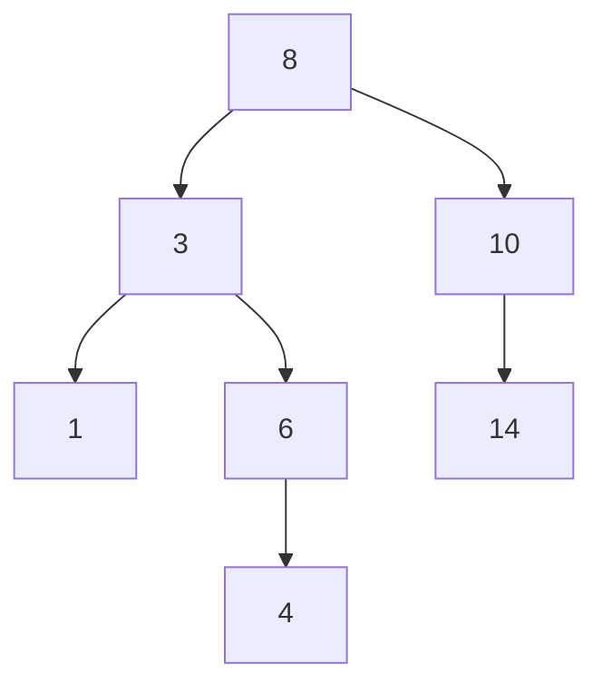

graph TD
## Trees

### 1. Overview and formal definition
A tree is an acyclic connected graph with a designated root node and a parent-child relationship that induces a hierarchy. Each node may have zero or more children. Trees are used to model hierarchical relationships (file systems, DOM, expression trees) and provide efficient search, insert, and delete operations when balanced.

### 2. Terminology
- Root: the unique top node.
- Parent / Child: adjacent relationship between levels.
- Leaf: node with no children.
- Sibling: nodes that share the same parent.
- Depth: distance from root to a node.
- Height: maximum depth of any leaf (height of tree).

### 3. Binary trees and BSTs
- Binary tree: each node has at most two children: `left` and `right`.
- Binary Search Tree (BST): for every node, all values in left subtree &lt; node.value &lt; all values in right subtree.

Operations on BST (average/expected when balanced):
- search: $O(\log n)$
- insert: $O(\log n)$
- delete: $O(\log n)$

Worst-case (completely unbalanced/skewed tree): $O(n)$.

### 4. Tree traversals
- Preorder: Root, Left, Right
- Inorder: Left, Root, Right (for BSTs yields sorted order)
- Postorder: Left, Right, Root
- Level-order: breadth-first using a queue

Recursive inorder example:
```java
void inorder(Node node) {
    if (node == null) return;
    inorder(node.left);
    System.out.print(node.val + " ");
    inorder(node.right);
}
```

### 5. Balanced trees
- AVL trees: maintain height-balance factor in \{-1,0,1\}; rotations (LL, RR, LR, RL) restore balance on insert/delete.
- Red-Black trees: color each node red/black and enforce properties that guarantee height \(O(\log n)\) with fewer rotations on average.

### 6. Special trees & uses
- B-trees / B+ trees: multi-way balanced trees used in databases and filesystems to reduce disk I/O.
- Segment trees / Fenwick (BIT): store aggregated ranges for interval queries and updates.
- Trie (prefix tree): specialized for string/prefix queries.

### 7. Example problems
- Check if a binary tree is a BST (inorder traversal or min/max recursive bounds).
- Lowest common ancestor (LCA) using parent pointers, binary lifting, or Euler tour + RMQ.

### 8. Diagrams
Binary tree example:


### 9. Notes & best practices
- When implementing BSTs for production, prefer balanced variants (AVL, Red-Black) to avoid worst-case linear behavior.
- Use recursion for clarity, but convert to iterative for deep trees to avoid stack overflow or use tail recursion optimization where available.
